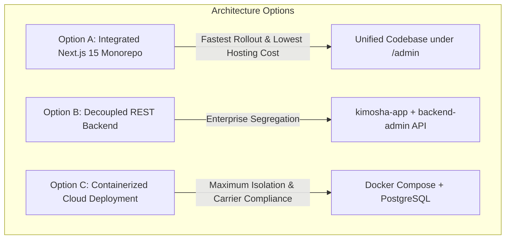

# Kimoksha Telecom - Enterprise Admin Dashboard Architectural Plan & Feature Selection Matrix

> **Document Version:** 2.0 (Comprehensive Revision)  
> **Status:** Architectural Blueprint & Modular Feature Selection for Client Approval  
> **Prepared For:** Kimoksha Telecom Management & Technical Leadership  
> **Live Website Reference:** [https://www.kimokshatelco.com/](https://www.kimokshatelco.com/)  
> **Benchmark Reference System:** `impc.in/admin` (Systematically analyzed in read-only audit mode)  

---

## 1. Executive Summary & Context

This revised architectural document defines the end-to-end blueprint for the **Kimoksha Telecom Admin Dashboard & Operations Command Center**. 

Following a deep, non-intrusive structural audit of the reference enterprise administration platform (`impc.in/admin`), this plan combines:
1. **Proven Architectural Patterns from the Reference Dashboard**: Dynamic CMS section toggles, lead lifecycle archiving, support ticket triage, media and testimonial moderation, granular security audit logs, IP blacklisting/whitelisting, and automated session heartbeat management.
2. **Telecom-Specific Mission-Critical Features**: Wholesale A-Z SMS and Voice rate deck distribution, live carrier PoP latency monitoring (Equinix DX1, LD4, FR2, SG1), bilateral interconnect lead qualification, and 24/7/365 NOC escalation ticketing.
3. **Clean Codebase Segregation**: Complete structural separation between the customer-facing frontend presentation files (`kimosha-app/`) and the backend administration engine (`backend-admin/`).

The document includes an **Interactive Feature Selection Checklist** organized by functional module, allowing you to select and approve the exact capabilities desired for Phase 1 and Phase 2 rollout.

---

## 2. Technical Stack & Infrastructure Audit (Reference vs. Target)

The reference dashboard (`impc.in/admin`) was audited across **32 dedicated administrative submodules**. Below is a technical comparison and the recommended modern enterprise stack for Kimoksha Telecom:

| Dimension | Reference Dashboard (`impc.in/admin`) | Recommended Kimoksha Telecom Stack | Architectural Rationale for Telecom |
|---|---|---|---|
| **Server & Hosting** | LiteSpeed Server on Hostinger hPanel | Vercel Enterprise / Node.js Container (AWS/DigitalOcean) | Low-latency edge delivery worldwide; global Anycast DNS. |
| **Backend Runtime** | PHP 8.3.33 with native sessions | Node.js 20+ (Next.js 15 / Express API) | Unified JavaScript/TypeScript ecosystem across full stack. |
| **Database Engine** | MySQL (Relational) | PostgreSQL (via Supabase / Neon) or SQLite (Prisma ORM) | ACID compliance for lead records, rate versions, and audit logs. |
| **Authentication** | Custom PHP Session (`PHPSESSID`) + CSRF Token | JWT Bearer Cookies (HttpOnly, Secure) + NextAuth / Jose | Stateless, tamper-proof session tokens with automated expiration. |
| **Session Control** | 30,000s timeout with 300s warning modal + `/session/keep-alive` | Configurable idle timer (15-60 min) + modal ping heartbeat | Prevents session hijacking on NOC workstations. |
| **Security Layer** | Form CSRF tokens, IP Block table, Security Log audit | Role-Based Access Control (RBAC), Argon2/Bcrypt, IP Whitelisting | Zero-trust admin access for sensitive telecom carrier data. |
| **Styling & UI** | Tailwind CSS + Lucide Icons + Glassmorphism | Kimoksha Design System (Tailwind CSS, Lucide, Brand Orange `#F26522`, Navy `#0F172A`) | Cohesive, ultra-premium dark/light carrier console. |
| **Asset Storage** | Local filesystem (`/uploads/img_...`) | Cloud Object Storage (AWS S3 / Cloudflare R2) + CDN | Secure versioned storage for wholesale Excel rate decks & assets. |

---

## 3. Structural Analysis: 32 Reference Modules & Telecom Adaptations

Every module on `impc.in/admin` has been evaluated and mapped to high-value wholesale telecom equivalents:

### 3.1 Overview & Dashboard Telemetry
- **Reference (`/admin/index`):** KPI summary cards (Total users, active inquiries, recent registrations, quick contact table).
- **Telecom Equivalent (`/admin/dashboard`):** 
  - Real-time counters: *Inbound Interconnect Requests*, *Active Wholesale Rate Decks*, *Direct MNO Binds (500+)*, *Global PoP Uptime (99.99%)*.
  - Live PoP Latency Strip: Equinix DX1 (Dubai), LD4 (London), FR2 (Frankfurt), SG1 (Singapore).
  - Recent Leads stream with instant one-click status transitions.

### 3.2 Lead Management & Carrier Interconnect CRM
- **Reference (`/admin/leads`, `/admin/archived`, `/admin/business_inquiries`):** Multi-stage lead management with active table, detailed contact info, student/customer credentials, and one-click archiving.
- **Telecom Equivalent (`/admin/leads`, `/admin/leads/archived`):**
  - Inbound stream from Home and Contact page **"Lets Connect"** forms.
  - Captured fields: Name, Corporate Email, Subject, Message, Client IP, Geo-Country, Timestamp.
  - Lifecycle Stages: `New Inbound` &rarr; `Contacted` &rarr; `Rate Deck Dispatched` &rarr; `Test Bind Provisioned` &rarr; `Interconnect Live / Converted` &rarr; `Archived`.
  - Internal Notes Thread: Sales and NOC engineers can append timestamped commentary.
  - One-click CSV/Excel export for offline CRM processing.

### 3.3 Operations & NOC Escalation Ticketing
- **Reference (`/admin/tickets`, `/admin/archived_tickets`):** Help center inquiry table with ID, user details, message preview, timestamp, status resolution, and archiving.
- **Telecom Equivalent (`/admin/noc/tickets`):**
  - Carrier support desk categorized by department (*NOC Desk*, *Bilateral Carrier Relations*, *Billing & CDRs*, *Routing & LCR*).
  - Severity matrix: `P1 - Critical (Route Down / Traffic Drop)` &bull; `P2 - High (DLR Failure / Post-Dial Delay)` &bull; `P3 - Normal (Rate Query / Interconnect Test)` &bull; `P4 - Low (General Inquiry)`.
  - SLA tracking timer: Visual alerts for tickets approaching SLA breach (e.g. >15 min for P1).

### 3.4 Wholesale Rate Deck Distribution (E-Commerce / LMS Equivalent)
- **Reference (`/admin/lms_courses`, `/admin/membership_plans`, `/admin/coupons`):** Catalog pricing, tiers (Bronze, Silver, Gold), digital course assets, and gift redemptions.
- **Telecom Equivalent (`/admin/rate-decks`):**
  - Wholesale Rate Sheet Hub: Upload and manage A-Z SMS, Direct CLI Voice, Non-CLI Voice, and SMPP rate decks (XLSX/CSV format).
  - Version Control: Semantic tagging (e.g. `Kimoksha_AZ_SMS_2026_Q3_v1.4`).
  - Gated Access Links: Generate time-limited or tokenized secure download links for prospective carrier partners with download tracking.

### 3.5 Dynamic Content Management (CMS) & Frontend Modifiers
- **Reference (`/admin/content`, `/admin/slides`, `/admin/cards`, `/admin/reviews`, `/admin/news`, `/admin/gallery`):** Toggle core homepage sections on/off, reorder hero slides, customize card grids, edit press clippings, and manage image galleries.
- **Telecom Equivalent (`/admin/cms/...`):**
  - **Hero & Global Metrics (`/admin/cms/hero`):** Edit live numbers displayed on the homepage without touching code (e.g. Connected Countries: 200+, Direct Binds: 500+, Delivery SLA: 99.99%).
  - **Carrier Network Map PoPs (`/admin/cms/network-pops`):** Update exchange node status (`ONLINE`, `MAINTENANCE`), latency values, and supported protocols displayed on the interactive SVG world map.
  - **Service Offerings Catalog (`/admin/cms/services`):** Modify technical specs (codecs G.711/G.729, SMPP v3.4 TPS throughput, jitter SLAs).
  - **Carrier Trust & Bilateral Partners (`/admin/cms/partners`):** Manage partner logos rendered in the auto-scrolling carrier marquee ticker.
  - **Media & Industry Events (`/admin/cms/events`):** Manage international carrier conference listings (ITW, Capacity Europe, MWC).
  - **Carrier Testimonials (`/admin/cms/testimonials`):** Edit carrier quotes, verified badges, and company attribution.

### 3.6 Policy & Information Pages CMS
- **Reference (`/admin/about_us`, `/admin/careers`, `/admin/privacy`, `/admin/terms`, `/admin/refund`, `/admin/contact_page`):** Dedicated rich-text editors for informational and legal pages.
- **Telecom Equivalent (`/admin/cms/pages`):**
  - Manage Company Overview, Executive Leadership, Careers/Open Shifts, Privacy Policy, Terms of Carrier Service, and NOC Escalation Contacts.

### 3.7 Security, Logs & Global Administration
- **Reference (`/admin/settings`, `/admin/security_logs`, `/admin/blocked_ips`, `/admin/clear_cache`):** Global branding (Logo, Favicon), social media links, login activity logs, and IP block table.
- **Telecom Equivalent (`/admin/settings`, `/admin/security`):**
  - **Site Branding & Identity:** Upload and update clean navbar logo, footer logo, and multi-resolution favicons.
  - **SEO & Global Scripts:** Dynamic meta title, description, OpenGraph preview, and Google Analytics / Tag Manager container insertion.
  - **Security Audit Logs:** Timestamped audit trail recording login attempts, rate deck uploads, lead status alterations, and administrative actions.
  - **IP Defense & Whitelisting:** Automatic lockout for repeated failed logins; optional CIDR whitelisting for authorized carrier NOC IPs.
  - **Cache Flushing:** Instant edge cache invalidation for updated rate sheets or site parameters.

---

## 4. Codebase Architecture & Directory Segregation

To maintain strict enterprise separation between client-facing presentation code and administrative backend systems, the workspace has been organized into segregated directories:

```
c:\Users\Admin\Desktop\KImosha\
├── kimosha-app/                          # [FRONTEND] Public Carrier & Enterprise Website (Next.js 15)
│   ├── public/                           # Static brand logos, SVG icons, manifests
│   └── src/
│       ├── app/                          # Next.js App Router (Public Pages)
│       │   ├── page.js                   # Homepage (Hero, Map, Services, 'Lets Connect')
│       │   ├── about/                    # About Kimoksha, PoPs, Infrastructure
│       │   ├── services/                 # Detailed SMS, Voice, SMPP technical specifications
│       │   ├── contact/                  # Contact Page, Operational Desks & Matrix
│       │   ├── layout.js                 # Root layout, fonts, SEO metadata, JSON-LD
│       │   └── globals.css               # Clean telecom design system & responsive utility styles
│       └── components/                   # Presentation components (Navbar, Hero, Map, Footer, etc.)
│
├── backend-admin/                        # [BACKEND / ADMIN] Segregated Operations & Command Engine
│   ├── config/                           # Environment variables, JWT secret, session rules
│   ├── database/
│   │   └── schema.sql                    # Production relational schema (PostgreSQL / SQLite)
│   ├── controllers/
│   │   ├── leadsController.js            # Inbound CRM, lead triage, status lifecycle, CSV export
│   │   ├── rateCardsController.js        # Wholesale rate sheets, versioning, download tokens
│   │   ├── contentController.js          # Dynamic CMS (Hero metrics, network PoPs, service cards)
│   │   ├── securityController.js         # Audit logging, failed logins, IP blocking
│   │   └── settingsController.js         # Global branding, SEO metadata, contact info
│   ├── middleware/
│   │   ├── authMiddleware.js             # JWT verification & Role-Based Access Control (RBAC)
│   │   └── (csrf & rate-limiting)       # Protection against brute-force attacks
│   ├── routes/
│   │   └── apiRoutes.js                  # Central REST endpoints for public forms & admin operations
│   ├── services/
│   │   └── notificationService.js        # SMTP alerts and team messaging webhooks
│   ├── package.json                      # Segregated backend package dependencies
│   └── README.md                         # Backend architecture & deployment documentation
│
└── ADMIN_DASHBOARD_PLAN.md               # Master Architecture Plan & Feature Selection Matrix
```

---

## 5. Master Feature Selection Checklist (Tick to Choose)

Please review the modular features below. Tick `[x]` for the options you want included in your custom Kimoksha Telecom Admin Dashboard:

```
[x] = Feature Selected for Implementation
[ ] = Feature Excluded / Deferred to Future Phase
```

### Module 1: Dashboard Overview & Real-Time Telemetry
- [ ] **1.1 Core Telecommunications KPI Cards**: Real-time display of Total Inbound Leads, Active Bilateral Partners, Wholesale Rate Decks Live, and Network Uptime SLA (99.99%).
- [ ] **1.2 Live PoP Latency Monitor**: Real-time latency indicators for Equinix DX1 (Dubai), LD4 (London), FR2 (Frankfurt), and SG1 (Singapore) with node status toggle (`ONLINE` / `DEGRADED` / `MAINTENANCE`).
- [ ] **1.3 Activity Feed & Quick Actions**: Live stream of latest contact submissions and recent operator actions with 1-click quick review.
- [ ] **1.4 Route Traffic Analytics (Simulated/Integrated)**: Visual chart showing monthly inquiry volume split by service interest (Wholesale SMS, SIP Voice, A2P OTP, SMPP).

### Module 2: Inbound Leads & Carrier Interconnect CRM ("Lets Connect")
- [ ] **2.1 Unified Inbound Lead Inbox**: Centralized data grid displaying all inquiries submitted via Home and Contact page forms.
- [ ] **2.2 Full Lead Profile Inspector**: Detailed modal/view showing Full Name, Corporate Email, Subject, Message, Submission Timestamp, Client IP, and approximate Geo-Location (Country/City).
- [ ] **2.3 6-Stage Lead Lifecycle Progression**: Status workflow dropdown:
  `[New]` &rarr; `[Contacted]` &rarr; `[Rate Card Sent]` &rarr; `[Test Bind Issued]` &rarr; `[Converted / Live]` &rarr; `[Archived]`.
- [ ] **2.4 Internal Team Notes Thread**: Ability for sales executives and NOC engineers to append internal commentary and history to any lead.
- [ ] **2.5 Lead Assignment**: Assign specific inquiries to dedicated account managers or NOC specialists.
- [ ] **2.6 One-Click CSV / Excel Export**: Instant download of all leads or filtered subsets for external CRM import or offline records.
- [ ] **2.7 Instant Email Alert**: Automated notification dispatched to `sales@kimokshatelco.com` upon every new website form submission.
- [ ] **2.8 Instant Team Messaging Webhook**: Immediate alert dispatched to a private Telegram, Slack, or WhatsApp group for high-priority carrier inquiries.
- [ ] **2.9 External CRM Webhook Sync**: Automated real-time push to HubSpot, Zoho CRM, or Salesforce.

### Module 3: Telecom Operations & Wholesale Rate Decks
- [ ] **3.1 Wholesale Rate Deck Manager**: Upload and manage wholesale A-Z SMS and Voice rate sheets in Excel (XLSX) or CSV format.
- [ ] **3.2 Rate Versioning & Effective Dates**: Assign version tags (e.g. `v2026.09-Q3`), currency denominations (`USD`, `EUR`, `GBP`), and effective implementation dates.
- [ ] **3.3 Gated Download Links**: Generate expiring, tokenized secure download links for verified carrier partners with download counters.
- [ ] **3.4 E.164 Prefix Normalization & Route Sandbox**: An internal utility for NOC staff to test international number formatting and check carrier route coverage.
- [ ] **3.5 Client Carrier Portal (Customer Facing)**: Standalone login for registered carrier partners to view bilateral account status, active binds, and download monthly statements.

### Module 4: Dynamic CMS & Frontend Modifiers
- [ ] **4.1 Hero & Global Metrics Counters Editor**: Edit the live numeric stats shown on the website (e.g. Connected Countries: 200+, MNO Binds: 500+, Uptime: 99.99%) without modifying code.
- [ ] **4.2 Interactive Network Map Node Controller**: Modify exchange node latency metrics, active status, and protocol labels on the frontend SVG carrier map.
- [ ] **4.3 Service Catalog & Technical Specs Editor**: Edit technical parameters displayed on `/services` (supported codecs, TPS rate limits, Post-Dial Delay SLAs).
- [ ] **4.4 Carrier Partner Logo Marquee Manager**: Upload, reorder, or toggle bilateral carrier logos in the auto-scrolling homepage ticker.
- [ ] **4.5 Industry Press & Events Manager**: Publish upcoming telecom industry conferences (ITW, Capacity Europe, MWC) and press coverage.
- [ ] **4.6 Carrier Testimonials & Trust Proof Editor**: Manage client quotes, reviewer credentials, verified badges, and ratings.
- [ ] **4.7 Legal & NOC Escalation Directory Editor**: Rich-text editing for Privacy Policy, Terms of Service, and NOC shift phone numbers / email escalation tiers.

### Module 5: NOC Support Desk & Escalation Ticketing
- [ ] **5.1 Operational Support Desk**: Unified queue for carrier technical issues, route degradation reports, and billing inquiries.
- [ ] **5.2 Multi-Tier Severity Matrix**: Tag tickets with `P1 - Critical`, `P2 - High`, `P3 - Normal`, or `P4 - Low`.
- [ ] **5.3 SLA Countdown Timer**: Visual warnings for tickets approaching maximum response time SLAs.
- [ ] **5.4 Ticket Resolution & Archiving**: Move resolved tickets to searchable archive with resolution documentation.

### Module 6: Security, System Governance & Access Control
- [ ] **6.1 Role-Based Access Control (RBAC)**: Distinct permissions for:
  - `Super Admin`: Full system privileges, user creation, global settings, content publishing.
  - `NOC Engineer`: Network node latency updates, technical tickets, route logs, rate cards.
  - `Sales & Billing`: Inbound lead management, client outreach, rate card distribution.
- [ ] **6.2 Two-Factor Authentication (2FA / TOTP)**: Require Google Authenticator / Authy 6-digit code on admin login.
- [ ] **6.3 Automated Session Timeout & Heartbeat**: Inactivity timeout with an interactive warning modal and background `/session/keep-alive` ping (matching `impc.in` reference).
- [ ] **6.4 Comprehensive Security Audit Trail**: Timestamped logging of all login attempts (success/fail), IP addresses, user agents, and operator changes.
- [ ] **6.5 Automated IP Brute-Force Shield**: Automatically block IP addresses after 5 consecutive failed login attempts.
- [ ] **6.6 IP Whitelist Restriction**: Restrict admin dashboard access exclusively to authorized office, datacenter, or VPN IP addresses.
- [ ] **6.7 Global Branding & Identity Manager**: Upload and update navbar logo, footer logo, and multi-resolution favicons from the dashboard.
- [ ] **6.8 SEO Meta & Script Injection Manager**: Edit meta title, meta description, and insert Google Analytics / Tag Manager / Pixel scripts.
- [ ] **6.9 Automated Database Snapshots**: Scheduled nightly automated backup of leads and system tables to secure cloud storage.

---

## 6. Implementation Strategy & Technical Architecture Options

We offer three flexible implementation pathways for deploying the Kimoksha Telecom Admin Dashboard:



### Option A: Integrated Next.js 15 Monorepo (Recommended for Quickest Time-to-Market)
- **Structure:** The admin dashboard is housed within the existing Next.js 15 app router (`src/app/admin/...`) with dedicated API route handlers (`src/app/api/admin/...`).
- **Database:** Serverless PostgreSQL (Neon or Supabase) with Prisma ORM.
- **Hosting:** Single deployment on Vercel or cloud provider with zero additional server overhead.
- **Advantages:** Zero CORS configuration, shared UI design system and components, instant deployment, automatic SSL.

### Option B: Decoupled REST Backend (Maximum Architectural Segregation)
- **Structure:** The `backend-admin/` directory runs as an independent Node.js/Express service, while `kimosha-app/` remains a lightweight public frontend consuming REST APIs.
- **Database:** Dedicated PostgreSQL or MySQL instance.
- **Hosting:** Public frontend on Vercel CDN; Admin backend on an isolated cloud VM or private VPC.
- **Advantages:** Complete physical segregation of admin code and database from the public website; enhanced security isolation.

### Option C: Containerized Enterprise Suite (Full Carrier Compliance)
- **Structure:** Multi-container Docker Compose setup containing:
  1. `kimoksha-web`: Public Next.js frontend container.
  2. `kimoksha-admin-api`: Dedicated Express/NestJS backend container.
  3. `kimoksha-db`: Encrypted PostgreSQL container with automated daily volume snapshots.
  4. `kimoksha-redis`: In-memory cache for session management and rate limiting.
- **Advantages:** Complete independence, portable across any cloud infrastructure (AWS, Azure, DigitalOcean, Equinix Bare Metal).

---

## 7. Next Steps & Approval Workflow

1. **Review Features**: Review the checklist in **Section 5** above and mark `[x]` next to the features you want implemented.
2. **Select Architecture Option**: Confirm your preferred deployment approach from **Section 6** (Option A, B, or C).
3. **Approve & Kickoff**: Once you approve the selected feature set, development of the admin dashboard database, authentication, and user interface will begin immediately according to your specifications.
